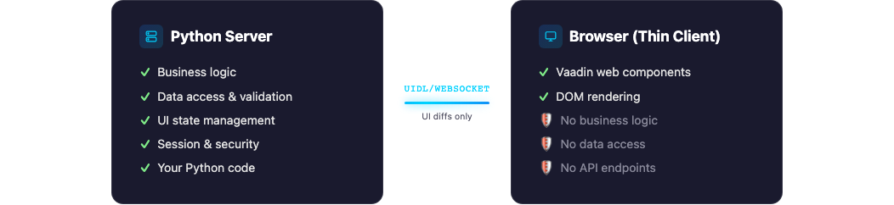
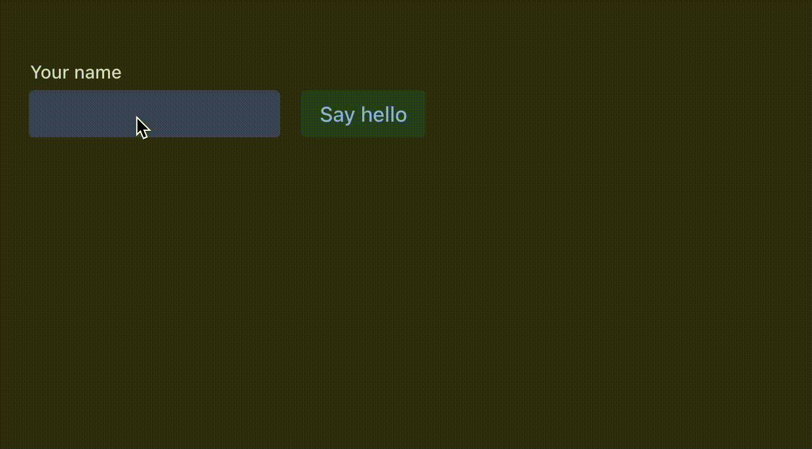

# PyFlow

**Build full-stack web apps in pure Python with Vaadin components.**

No JavaScript. No HTML templates. Your code runs on the server -- the browser is just a thin client.



---

```python
from vaadin.flow import Route
from vaadin.flow.components import *

@Route("hello")
class HelloView(HorizontalLayout):
    def __init__(self):
        name = TextField("Your name")
        button = Button("Say hello", lambda e:
            Notification.show(f"Hello {name.value}"))
        self.add(name, button)
```



## Features

- **Server-side only** -- all logic runs in Python, no JavaScript to write
- **Real-time push** -- update the UI from background tasks via WebSocket
- **Lazy data loading** -- Grid with virtual scrolling and server-side sorting
- **Form validation** -- Binder with validators and converters
- **Theming** -- Lumo and Aura themes with dark mode support
- **Hot reload** -- `--dev` mode watches for file changes

## Installation

```bash
pip install git+https://github.com/manolo/vaadin-pyflow.git
```

## Quick start

```bash
mkdir my-app && cd my-app
python -m venv .venv
source .venv/bin/activate   # Windows: .venv\Scripts\activate
pip install git+https://github.com/manolo/vaadin-pyflow.git
vaadin --setup
vaadin
# http://localhost:8080
```

This scaffolds a project with `views/`, `static/`, and VSCode config:

```
my-app/
  views/
    main_layout.py    # AppLayout with SideNav
    hello_world.py    # Sample view with TextField + Button
  static/
    favicon.ico
    styles/
      styles.css
    images/
  .vscode/            # VSCode settings, snippets, extensions
```

### Running

```bash
vaadin [app_module] [options]

  app_module               Python module with views/ (auto-detected if omitted)
  --setup [app_name]       Scaffold a new project (views, static, .vscode/)
  --vscode                 Generate .vscode/ config and install recommended extensions
  --dev                    Auto-reload on source changes
  --debug                  Verbose UIDL protocol logging
  --port PORT              Server port (default: 8080)
  --host HOST              Server host (default: localhost)
  --bundle                 Generate frontend bundle
```

## Routing

```python
from vaadin.flow import Route, Menu

@Route("dashboard", page_title="Dashboard", layout=MainLayout)
@Menu(title="Dashboard", order=1, icon="vaadin:dashboard")
class DashboardView(VerticalLayout):
    ...
```

- `@Route(path)` -- register a view at a URL path
- `@Route(path, layout=MainLayout)` -- wrap in a layout
- `@Menu(title, order, icon)` -- add to the navigation menu
- Route parameters: `@Route("greet/:name")` with `on_parameter_changed(self, params)`

## Application shell

```python
from vaadin.flow import AppShell, Push, ColorScheme, StyleSheet
from vaadin.flow.components import AppLayout, DrawerToggle, H1, SideNav, SideNavItem
from vaadin.flow.menu import get_menu_entries

@AppShell
@Push
@ColorScheme("dark")
@StyleSheet("lumo/lumo.css", "styles/styles.css")
class MainLayout(AppLayout):
    def __init__(self):
        self.add_to_navbar(DrawerToggle(), H1("My App"))
        nav = SideNav()
        for entry in get_menu_entries():
            nav.add_item(SideNavItem(entry.title, entry.path))
        self.add_to_drawer(nav)
```

## Grid with lazy data

```python
grid = Grid()
grid.add_column("name", header="Name").set_sortable(True).set_auto_width(True)
grid.add_column("email", header="Email").set_auto_width(True)
grid.set_data_provider(my_fetch)

def my_fetch(offset, limit, sort_orders):
    return items[offset:offset+limit], len(items)
```

## Real-time push

```python
import asyncio

@Route("live")
class LiveView(VerticalLayout):
    def __init__(self):
        self.label = Span("0")
        self.add(self.label)
        asyncio.get_event_loop().create_task(self._tick())

    async def _tick(self):
        n = 0
        while True:
            await asyncio.sleep(1)
            n += 1
            ui = self.get_ui()
            if ui:
                ui.access(lambda: self.label.set_text(str(n)))
```

Requires `@Push` on the `@AppShell` class.

## Components


| Type | Component | Description |
|------|-----------|-------------|
| Input | `TextField` | Single-line text input |
| Input | `TextArea` | Multi-line text input |
| Input | `PasswordField` | Masked password input |
| Input | `EmailField` | Email input with RFC 5322 validation |
| Input | `NumberField` | Numeric input with min/max/step |
| Input | `IntegerField` | Integer-only variant |
| Input | `Checkbox` / `CheckboxGroup` | Toggle and multiple selection |
| Input | `RadioButtonGroup` | Single selection from options |
| Input | `Select` | Dropdown single selection |
| Input | `ComboBox` / `MultiSelectComboBox` | Filterable dropdown (multi-select) |
| Input | `DatePicker` / `TimePicker` / `DateTimePicker` | Date and time selection |
| Input | `Upload` | File upload |
| Input | `CustomField` | Composite custom field |
| Data | `Grid` | Data table with sorting, selection, lazy loading, renderers |
| Data | `TreeGrid` | Hierarchical data table with expand/collapse |
| Layout | `VerticalLayout` / `HorizontalLayout` | Stack children vertically or horizontally |
| Layout | `FlexLayout` | CSS Flexbox layout |
| Layout | `FormLayout` | Responsive form with labels and colspan |
| Layout | `SplitLayout` | Resizable two-panel split |
| Layout | `AppLayout` | Application shell with navbar and drawer |
| Layout | `Scroller` | Scrollable container |
| Layout | `Card` | Styled card container |
| Layout | `Details` / `Accordion` | Collapsible sections |
| Layout | `Dialog` / `ConfirmDialog` | Modal dialogs |
| Layout | `MasterDetailLayout` | Master-detail pattern |
| Navigation | `Tabs` / `TabSheet` | Tab navigation with content panels |
| Navigation | `SideNav` | Side navigation with items |
| Navigation | `MenuBar` / `ContextMenu` | Hierarchical and right-click menus |
| Navigation | `RouterLink` | Client-side navigation link |
| Display | `Button` | Click listener, icon support, keyboard shortcuts |
| Display | `Icon` | Vaadin and Lumo icon sets |
| Display | `Notification` | Toast notifications with position and duration |
| Display | `ProgressBar` | Determinate and indeterminate progress |
| Display | `Avatar` / `AvatarGroup` | User avatars |
| Display | `Span`, `H1`-`H6`, `Paragraph`, `Pre` | Text elements |
| Display | `Image`, `Anchor`, `IFrame` | Media and links |

## Development

See [README-DEV.md](README-DEV.md) for setup, tests, project structure, and architecture.

## License

Apache License 2.0
